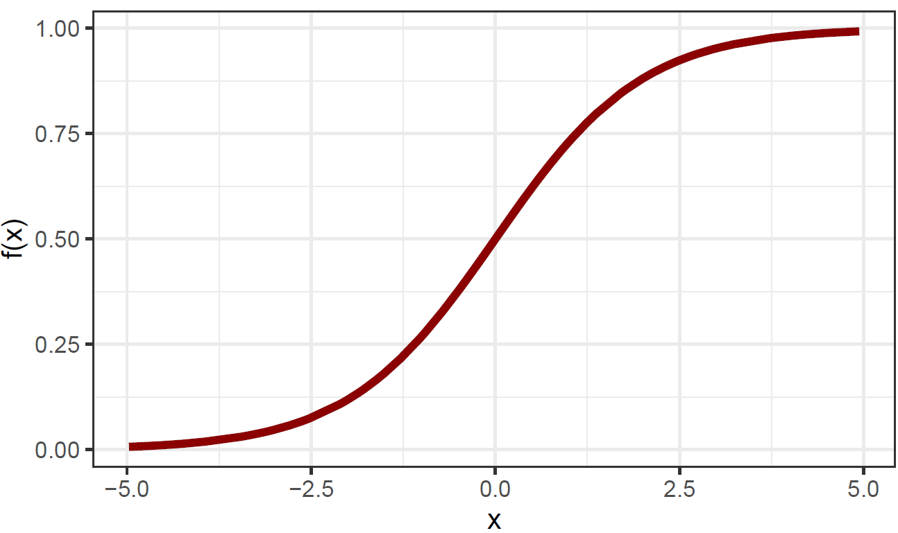
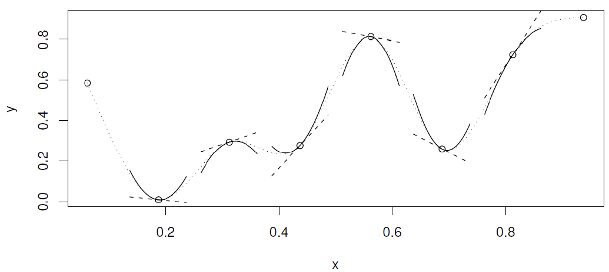
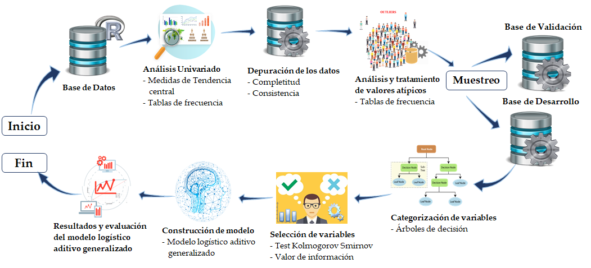
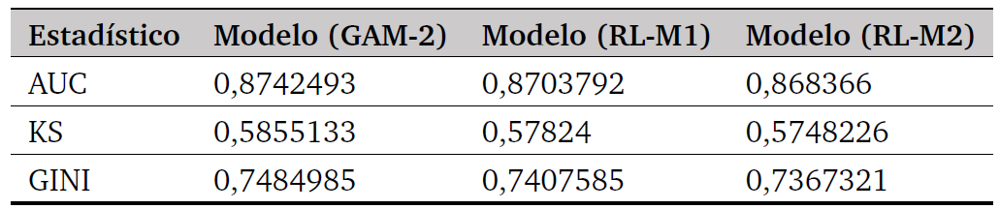
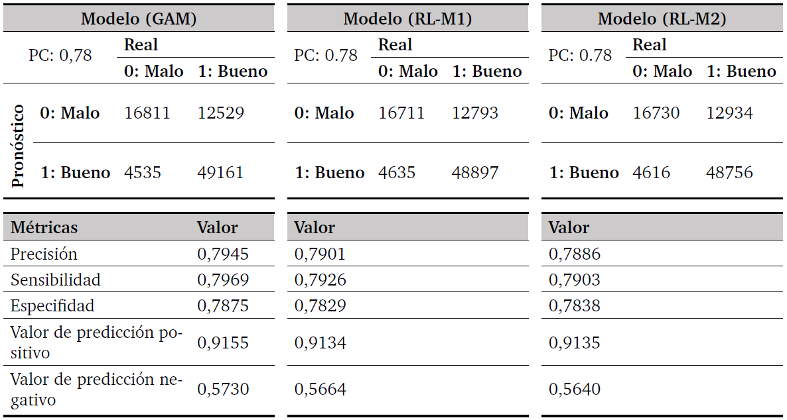
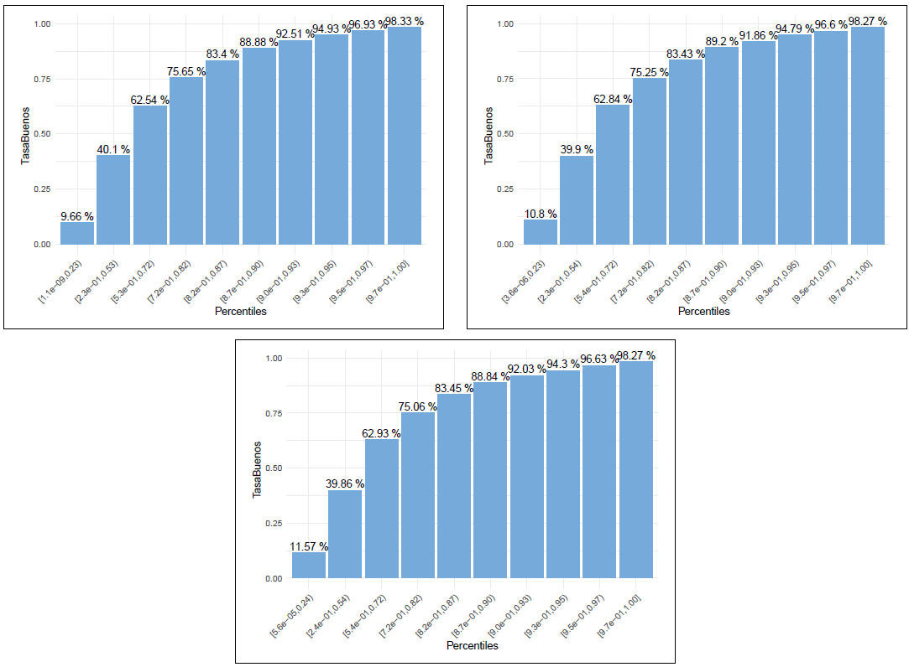
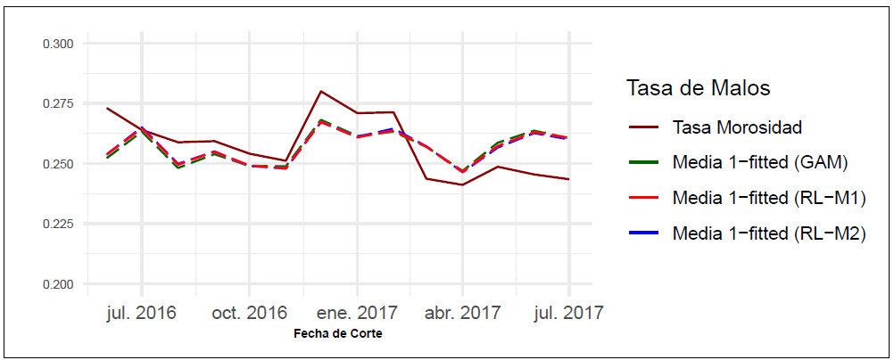

```{r share-again, echo=FALSE}
options(htmltools.dir.version = FALSE, htmltools.preserve.raw = FALSE)
#xaringanExtra::use_share_again()
xaringanExtra::use_fit_screen()
```

class: title-slide, clear   


<div class="footer"><span> 
  <div class="row">
  <div class="content1"><center> ciencias.epn.edu.ec	 </center></div> 
  <div class="content1"><center> Facultad de Ciencias – Escuela Politécnica Nacional </center> </div> 
  </div>
</span></div>

<div class="definition_box3" style="margin-bottom:40px;">
<b> CONGRESO DE INVESTIGACIÓN APLICADA A CIENCIA DE DATOS II CONGRESO NACIONAL DE R USERS GROUP – ECUADOR</b>
</div>

<div class="definition_box4" style="margin-bottom:40px;">
<b> CREDIT SCORING: APLICANDO TÉCNICAS DE REGRESIÓN LOGÍSTICA Y  MODELOS ADITIVOS GENERALIZADOS PARA UNA CARTERA DE CRÉDITO EN UNA ENTIDAD FINANCIERA</b>
</div>
 
<div style="text-align: center; font-weight: bold; font-size: 24px; margin-bottom:10px;">
Jaime Andrés Suquillo LLumiquinga 
</div>

<div style="text-align: center; font-size: 26px; margin-bottom:5px;">
Escuela Politécnica Nacional, Quito-Ecuador
</div>

<div style="text-align: center; font-size: 24px;">
jaime.suquillo@epn.edu.ec
</div>


---

layout: true

<div class="footer"><span> 
  <div class="row">
  <div class="content1"><center> ciencias.epn.edu.ec	 </center></div> 
  <div class="content1"><center> Facultad de Ciencias – Escuela Politécnica Nacional </center> </div> 
  </div>
</span></div> 

---
class: cambio-slide, clear

<h1> PROBLEMÁTICA </h1>

<div class="footer"><span> 
  <div class="row">
  <div class="content1"><center> ciencias.epn.edu.ec	 </center></div> 
  <div class="content1"><center> Facultad de Ciencias – Escuela Politécnica Nacional </center> </div> 
  </div>
</span></div>

<div class="txt3" style = "margin-top: -275px;">
Modelos estadísticos, como el análisis discriminante lineal, la regresión logística, el árbol de clasificación y regresión, random forest y redes neuronales, son utilizados en la calificación crediticia.</br> </br>

De estos modelos la regresión logística es el más utilizado en la industria. A pesar de sus ventajas en la fácil interpretación y el bajo costo computacional, está bajo la crítica de la dificultad de modelar las características no lineales, del efecto de los predictores sobre la variable dependiente y, por lo tanto, podría dar lugar a resultados insatisfactorios.</br> </br>

Por otro lado, aunque las redes neuronales pueden ser más poderosas que la regresión logística, no se usan ampliamente en la calificación crediticia porque son una caja negra con respecto a la interpretación ya que la ausencia de razones por las cuales la red neuronal ha tomado sus decisiones, puede ser inaceptable.
</div>

---

class: slides-demo

# Objetivos

--
<div class="definition_box1" style="margin-top:50px; margin-bottom:30px;">
  <div class="childA">
    <div class="titlebox"> 
  Objetivo General
    </div>
  </div>
  <div class="childB">
    <div class="txt"> 
  Comparar dos técnicas estadísticas: Regresión Logística y Modelos Aditivos Generalizados
que permitirán estimar la probabilidad de incumplimiento de un cliente al momento de la concesión del crédito.
    </div>
  </div>
</div>

--

* Establecer los determinantes del incumplimiento del crédito.

--

* Establecer modelos estadísticos robustos mediante la técnica Regresión Logística
y el algoritmo de Modelos Aditivos Generalizados que permitan comparar empíricamente
los resultados obtenidos.

--

* Implementar un código en el lenguaje de programación estadístico R que realice
automáticamente la metodología analítica utilizada en la generación del modelo y
nos propine resultados óptimos para la toma de decisiones acertadas.

---

layout: false


class: clear, inverse, mline, center, middle

# Metodología

---

layout: true

<div class="footer"><span> 
  <div class="row">
  <div class="content1"><center> ciencias.epn.edu.ec	 </center></div> 
  <div class="content1"><center> Facultad de Ciencias – Escuela Politécnica Nacional </center> </div> 
  </div>
</span></div>    

<style>
.mjx-mrow a {
  color: black;
  pointer-events: none;
  cursor: default;
}
</style>


---

class: slides-demo

# Modelo de regresión logística - logit

<h3 style = "margin-bottom: -10px" > Introducción </h3>  

--
La modelación estadística permite explicar la relación entre una **variable dependiente** $Y$, y un conjunto de $p$ **variables independientes** ${ X }_{ 1 },{ X }_{ 2 },\dots ,{ X }_{ p }$.

--
\begin{align}
Y&=f\left( { X }_{ 1 },{ X }_{ 2 },\dots ,{ X }_{ p } \right)+\epsilon,\tag{1}
\end{align}

donde: 

--
* $f:$ función desconocida fija de ${ X }_{ 1 },{ X }_{ 2 },\dots ,{ X }_{ p }$. 

--
* $\epsilon:$ término de error aleatorio.

--

<div class="txt1" style = "margin-top: 25px; margin-bottom: 0px"> 
Con ayuda de modelos estadísticos se estima una función `f` que satisfaga la igualdad `(1)`.
</div>


---

class: slides-demo

# Modelo de regresión logística - logit

<h3 style = "margin-bottom: 0px" > Modelos paramétricos </h3>  

--
<div class="txt1" style = "margin-top: 15px; margin-bottom: 20px"> 
Asumen que la función `f` tiene una forma funcional específica.
</div>


--
* Se realiza un supuesto sobre la forma funcional de $f$.

--

\begin{align}
    f\left( X \right) &={ \beta  }_{ 0 }+{ \beta  }_{ 1 }{ X }_{ 1 }+{ \beta  }_{ 2 }{ X }_{ 2 }+\dots +{ \beta  }_{ p }{ X }_{ p }\tag{2}
\end{align}

--
* Para el ajuste del modelo lineal $\left(2\right)$, se necesita estimar los $p+1$ parámetros ${ \beta  }_{ 0 },{ \beta  }_{ 1 },\dots ,{ \beta  }_{ p }$,


\begin{align}
    \hat{Y} &\approx { \hat { \beta  }   }_{ 0 }+{ \hat { \beta  } }_{ 1 }{ X }_{ 1 }+{ \hat { \beta  } }_{ 2 }{ X }_{ 2 }+\dots +{ \hat { \beta  } }_{ p }{ X }_{ p }, \tag{3}
\end{align}


--
El **Modelo Lineal Generalizado** generaliza el modelo lineal clásico, de manera que la variable dependiente $Y$ está relacionada linealmente con las variables explicativas mediante una determinada función de enlace (Función Link). Estos modelos forman parte del enfoque paramétrico e incluyen el **Modelo de regresión logística múltiple**.

---

class: slides-demo

# Modelo de regresión logística - logit

<div class="txt1" style = "margin-top: 30px; margin-bottom: 10px"> 
<b>Modelo logit</b> se utiliza para predecir la probabilidad de una variable dependiente categórica, en nuestro caso binaria: Bueno `(1)` y Malo `(0)`.
</div>

--

<div class="txt1" style = "margin-top: 0px; margin-bottom: 3px"> 
Para describir el modelo, consideremos:  
</div>

--
* $n:$ Número de individuos en una muestra aleatoria.

--
* $p:$ Número de varibles explicativas o independientes.

--
* $X=\left( X_{ 1 },X_{ 2 },...,{ X }_{ p } \right):$ Conjunto de $p$ variables independientes.

--
* $X_{ i }=\left(1, { x }_{ i1 }, { x }_{ i2 },\dots { x }_{ ip } \right):$ Vector de características del individuo $i$, donde ${ x }_{ ij }$ es el valor de la variable $j=1,2,\dots ,p$ en el individuo $i=1,2,\dots ,n$.

--
* $Y=\left( y_{ 1 },y_{ 2 },...,y_{ n } \right):$ La variable dependiente, donde ${ y }_{ i }$ es el valor de la variable $Y$ en el individuo $i$. El valor ${ y }_{ i }$, representa lo siguiente: 

$$y_i =\begin{cases} 1: \textrm{Si el individuo i es etiquetado como Bueno} \\ 0: \textrm{Si el individuo i es etiquetado como Malo.} \end{cases}\tag{4}$$

--
* $\beta =\left( { \beta  }_{ 0 },{ \beta  }_{ 1 },{ \beta  }_{ 2 },\dots ,{ \beta  }_{ p } \right) :$ Vector de $p+1$ parámetros (constantes) desconocidos.

---

class: slides-demo

# Modelo de regresión logística - logit

<div class="txt1" style = "margin-top: 35px; margin-bottom: 15px"> 
La base del <b>Modelo Logit</b> es la función de distribución logística, y está definida de la siguiente manera: </div>

--
\begin{align}
    { \pi  }_{ i }&=Pr\left( { y }_{ i }=1|{ X }_{ i } \right) =\frac { 1 }{ 1+exp\left( -{ \tau  }_{ i } \right)  } ,\quad -\infty <{ \tau  }_{ i }<\infty ,\quad i=1,2,\dots, n\tag{5}    
\end{align}

--
con,

--
\begin{align*}
    { \tau  }_{ i }&={ { X } }_{ i }^{ T }\beta ={ \beta  }_{ 0 }+{ \beta  }_{ 1 }{ x }_{ i1 }+{ \beta  }_{ 2 }{ x }_{ i2 }+\dots +{ \beta  }_{ p }{ x }_{ ip }.
\end{align*}

Donde:

--
* ${ \pi  }_{ i }:$ Permite encontrar la probabilidad de que el individuo $i$ sea etiquetado como $Bueno$, tomando en cuenta las características ${ X }_{ i }$ que posee. El rango de esta función está en el intervalo $\left[ 0,1 \right]$

--

El modelo tiene como objetivo estimar los coeficientes ${ \beta }$ que mejor se ajusten a la ecuación $\left(5\right)$.

---

class: slides-demo

# Modelo de regresión logística - logit

<div class="txt1" style = "margin-top: 35px; margin-bottom: 0px"> 
Despejando `\tau_{ i }` de `(5)` se obtiene la igualdad conocida como <b>Modelo logit</b>.
</div>

--

\begin{align}
   { \tau  }_{ i }= logit\left( { \pi  }_{ i } \right) =\ln { \left( \frac { { \pi  }_{ i } }{ 1-{ \pi  }_{ i } }  \right)  } ={ \beta  }_{ 0 }+{ \beta  }_{ 1 }{ x }_{ i1 }+{ \beta  }_{ 2 }{ x }_{ i2 }+\dots +{ \beta  }_{ p }{ x }_{ ip }\tag{6}
\end{align}

--

<div class="txt1" style = "margin-top: -5px; margin-bottom: 10px"> 
A la ecuación `(6)` se la conoce como razón de probabilidades `(odds` `ratio)`. La función <i>logística</i> `(5)` puede ser representada gráficamente:
</div>


--
<figure style = "margin-top: 0px; margin-bottom: 0px">
<figcaption style="text-align: center;">Fig.1 - Función logística.</figcaption>
  
</figure>

---

class: slides-demo

# Modelo logístico aditivo generalizado

<h3 style = "margin-bottom: 0px" > Modelos no paramétricos </h3>  

--

* Antes de ajustar la función $f$ no realiza suposición alguna sobre la forma funcional de la misma.

--
* Se pueden usar funciones suaves en la búsqueda de la función $f$

--
* El riesgo que se asume con estos modelos, es el fenómeno conocido como sobreajuste.

--
* Pueden conducir a estimaciones muy complejas de $f$.

--

<div class="txt1" style = "margin-top: 25px; margin-bottom: 0px"> 
El <b>Modelo Aditivo Generalizado</b> ofrece un punto medio:
</div>

--
* Se adapta a relaciones complejas y no lineales.

--
* Mantiene la aditividad, haciendo uso de elementos paramétricos y no paramétricos.

--
* Hace buenas predicciones, y aún permite realizar estadísticas inferenciales.

--
* Se comprende y se puede explicar el porqué de las predicciones que hace. 

---

class: slides-demo

# Modelo logístico aditivo generalizado

<div class="definition_box2" style = "margin-top: 35px; margin-bottom: 15px">
<div class="txt1">
El <b>Modelo Aditivo Generalizado</b>, es una extensión de los Modelos Lineales Generalizados (GLM) al permitir funciones no lineales en cada una de las variables explicativas, mientras se mantiene la aditividad.
</div>
</div>

--
<div class="txt1" style = "margin-top: 15px; margin-bottom: 0px"> 
La estructura del modelo toma la siguiente forma:
</div>

\begin{align}
    g\left( { u }_{ i } \right) ={ { { X } }_{ i }^{ { \ast  } } }\theta +{ f }_{ 1 }\left( { x }_{ i1 } \right) +{ f }_{ 2 }\left( { x }_{ i2 } \right) +{ f }_{ 3 }\left( { x }_{ i3 } \right) +\dots  \tag{7}
\end{align}

<div class="txt1" style = "margin-top: 0px; margin-bottom: 0px"> 
donde:
</div>

--
* ${ u }_{ i }\equiv \mathbb{E}\left( { Y }_{ i } \right)$ con ${ Y }_{ i }\sim$ alguna distribución de la Familia Exponencial.

--
* $g\left(  \right)$ es la función de enlace.

--
* ${ { X } }_{ i }^{ { \ast  } }$ es la $i-\acute{e}sima$ fila de la matriz del modelo correspondiente a las variables explicativas paramétricas.

--
* $\theta$ es el vector de coeficientes correspondiente.

--
* ${ f }_{ j }$ son las funciones suaves de las variables que se modelan no paramétricamente.

---

class: slides-demo

# Modelo logístico aditivo generalizado

<div class="txt1" style = "margin-top: 35px; margin-bottom: 0px"> 
Esta flexibilidad lleva consigo dos necesidades:
</div>

--

* Cómo representar las funciones suaves.

--
* Cómo suavizar estas funciones.

--

<div class="txt1" style = "margin-top: 25px; margin-bottom: 0px"> 
Algunos de los métodos de suavizamiento son: 
</div>

--

**Splines de suavizado, splines de regresión, etc.**

--
* Se pueden expresar utilizando expansiones de base. 

--
* La estimación con splines de regresión se realiza mediante PIRLS (mínimos cuadrados reponderados iterativamente penalizados).

--

**Suavizamiento por núcleos (Kernel Smoothing) y regresión polinomial local (LOESS)**

--
* No se pueden expresar mediante la expansión de base.

--
* La estimación, se realiza mediante el algoritmo backfitting (Breiman y Friedman, 1985).

---

class: slides-demo

# Modelo logístico aditivo generalizado

<h3 style = "margin-bottom: 0px" > Suavizado Univariante - Funciones de Base </h3>  

--
<div class="txt1" style = "margin-top: 25px; margin-bottom: 0px"> 
La ecuación `(7)` simplificada a una función suave como regresor es igual a:
</div>

--

\begin{align}
    { y }_{ i }=f\left( x_{ i } \right) +{ \epsilon  }_{ i },\quad i=1,2,\dots ,n \tag{8}
\end{align}

<div class="txt1" style = "margin-top: 10px; margin-bottom: 10px"> 
donde:
</div>

--

* ${ y }_{ i }:$ Variable dependiente.

--
* $x_{ i }:$ Variable explicativa (regresor).

--
* $f:$ Una función suave.

--
* ${ \epsilon  }_{ i }:$ Error aleatorio idénticamente distribuido con distribución $N\left( 0,{ \sigma  }^{ 2 } \right)$.

--

<div class="txt1" style = "margin-top: 15px; margin-bottom: 0px"> 
Para convertir la ecuación `(8)` en un modelo lineal, es necesario elegir una base. Para lo cual, se define:
</div>

--

* ${ b }_{ j }:$ Espacio de **funciones base** de dimensión $q+1$ en donde $f$ (o una buena aproximación), esté presente.


---

class: slides-demo

# Modelo logístico aditivo generalizado

<h3 style = "margin-bottom: 0px" > Suavizado Univariante - Funciones de Base </h3>  

--
<div class="txt1" style = "margin-top: 25px; margin-bottom: 0px"> 
[Wood, Simon N., 2017], define esta base mediante una combinación lineal entre algunas <b>funciones básicas</b> conocidas y un vector de parámetros desconocidos `\beta`, con lo cual `f` toma la siguiente forma:
</div>


--

\begin{align}
f\left( x \right) =\sum _{ j=0 }^{ q }{ { b }_{ j }\left( x \right) { \beta  }_{ j } } \tag{9}
\end{align}

--
Realizando la sustitución de $(9)$ en $(8)$, se obtiene el siguiente modelo lineal que puede estimarse fácilmente:

--
\begin{align*}
{ y }_{ i }=\sum _{ j=0 }^{ q }{ { b }_{ j }\left( x \right) { \beta  }_{ j } } +{ \epsilon  }_{ i },\quad i=1,2,\dots ,n
\end{align*}

---

class: slides-demo

# Modelo logístico aditivo generalizado

<h3 style = "margin-bottom: 0px" > Regresión Polinómica </h3>  

--
<div class="txt1" style = "margin-top: 20px; margin-bottom: 0px"> 
La construcción de `f` se puede realizar mediante la técnica conocida como <b>regresión polinómica</b>, la cual hace uso de una <b>base polinómica</b>.
</div>

--
<div class="txt1" style = "margin-top: 20px; margin-bottom: 0px"> 
El modelo que se obtiene al ajustar la función `f` mediante una función polinómica de grado `d,` es el siguiente
</div>

--

\begin{align}
{ y }_{ i }={ \beta  }_{ 0 }+{ \beta  }_{ 1 }x_{ i }+{ \beta  }_{ 2 }{ x }_{ i }^{ 2 }+\dots +{ \beta  }_{ d }{ x }_{ i }^{ d }+{ \epsilon  }_{ i } \tag{10}
\end{align}

--

<div class="txt1" style = "margin-top: 0px; margin-bottom: 0px"> 
En donde `1,x_{ i },x_{ i }^{ 2 },...,x_{ i }^{ d }` son funciones básicas.
</div>

--
<div class="txt1" style = "margin-top: 10px; margin-bottom: 0px"> 
Para un grado `d` suficientemente grande, la <b>regresión polinómica</b>:
</div>

--

* Genera una curva extremadamente no lineal.

--
* Puede adoptar comportamientos muy extraños.

--
* Conlleva a sufrir de inestabilidad en los bordes.

--

La alternativa adecuada es la estimación por splines.

---

class: slides-demo

# Modelo logístico aditivo generalizado

<h3 style = "margin-bottom: 0px" > Splines Cúbicos de Regresión </h3>  

--
<div class="txt1" style = "margin-top: 20px; margin-bottom: 0px"> 
Estiman `f` dividiendo la función original en secciones y ajustando cada sección con un polinomio de menor grado. Cada punto que une las distintas secciones se conoce como “nodo”
</div>

--
<div class="txt1" style = "margin-top: 20px; margin-bottom: 5px"> 
La base que permite estimar `f` está formada por splines y se la conoce como <b>B-spline</b>.
</div>


--
<div class="definition_box2" style="margin-top:20px;">
<div class="txt1">
Una <b>B-Spline</b> de orden `d` es un polinomio de grado `d-1`, que es continuo hasta la derivada `d-2` en la transición entre nodos.
</div>
</div>

--
<div class="txt1" style = "margin-top: 25px; margin-bottom: 15px"> 
Si tomamos `d=3` en la ecuación `(10)`, se obtiene el siguiente modelo de regresión cúbico:
</div>

--

\begin{align}
    { y }_{ i }={ \beta  }_{ 0 }+{ \beta  }_{ 1 }{ x }_{ i }+{ \beta  }_{ 2 }{ x }_{ i }^{ 2 }+{ \beta  }_{ 3 }{ x }_{ i }^{ 3 }+{ \epsilon  }_{ i } \tag{11}
\end{align}

--
En donde, los coeficientes ${ \beta  }_{ 0 }$, ${ \beta  }_{ 1 }$, ${ \beta  }_{ 2 }$ y ${ \beta  }_{ 3 }$ son diferentes en las distintas secciones y el ajuste de ${ y }_{ i }$ se realiza mediante un polinomio cúbico definido a trozos.


---

class: slides-demo

# Modelo logístico aditivo generalizado

<div class="txt1" style = "margin-top: 30px; margin-bottom: -20px"> 
Un polinomio cúbico definido a trozos con un solo nodo en un punto `x^{ \prime }` se define de la forma:
</div>


\begin{align}
    { y }_{ i }=\begin{cases} { \beta  }_{ 01 }+{ \beta  }_{ 11 }{ x }_{ i }+{ \beta  }_{ 21 }{ x }_{ i }^{ 2 }+{ \beta  }_{ 31 }{ x }_{ i }^{ 3 }+{ \epsilon  }_{ i }\quad si\quad { x }_{ i }<{ { x }^{ \prime  } } \\ { \beta  }_{ 02 }+{ \beta  }_{ 12 }{ x }_{ i }+{ \beta  }_{ 22 }{ x }_{ i }^{ 2 }+{ \beta  }_{ 32 }{ x }_{ i }^{ 3 }+{ \epsilon  }_{ i }\quad si\quad { x }_{ i }\ge { { x }^{ \prime  } } \end{cases} \tag{12}
\end{align}

--
<div class="txt1" style = "margin-top: 5px; margin-bottom: -30px"> 
De modo que, `(12)` realiza el ajuste de los datos mediante dos funciones polinómicas diferentes. 
</div>

--

<figure>
<figcaption style="text-align: center;">Fig.2 - Spline Cúbico.</figcaption>
  
</figure>

--
<div class="txt1" style = "margin-top: -25px; margin-bottom: -25px"> 
Gráficamente un <b>spline cúbico</b> según  [Wood, Simon N., 2017], es una curva compuesta por secciones de polinomios cúbicos unidos de tal forma que la curva sea continua hasta la segunda derivada en cada nodo.
</div>

---

class: slides-demo

# Modelo logístico aditivo generalizado

<h3 style = "margin-bottom: 0px" > Splines Cúbicos - Bases </h3>  

--

<div class="txt1" style = "margin-top: 15px; margin-bottom: 0px"> 
Una base muy usada es la propuesta por [James et al., 2014], hace uso de `k` nodos `x_{ i }^{ \prime  }` con `i=1,2,...,k`. Cuyas funciones básicas son:
</div>

--

$${ b }_{ 1 }\left( x \right) =x,\quad { b }_{ 2 }\left( x \right) ={ x }^{ 2 },\quad { b }_{ 3 }\left( x \right) ={ x }^{ 3 } \\ { b }_{ 4 }\left( x \right) =R\left( x,{ x }_{ 1 }^{ \prime  } \right) ,\quad { b }_{ 5 }\left( x \right) =R\left( x,{ x }_{ 2 }^{ \prime  } \right) ,\dots ,{ b }_{ k+3 }\left( x \right) =R\left( x,{ x }_{ k }^{ \prime  } \right),$$

--
<div class="txt1" style = "margin-top: -5px; margin-bottom: 0px"> 
con,
</div>

\begin{align}
R\left( x,{ x }_{ i }^{ \prime  } \right) ={ \left( x-{ x }_{ i }^{ \prime  } \right)  }_{ + }^{ 3 }\begin{cases} { \left( x-{ x }_{ i }^{ \prime  } \right)  }^{ 3 },\quad si\quad x>{ x }_{ i }^{ \prime  } \\ ~~~~~~0~~~~~~, \quad si \quad x\le { x }_{ i }^{ \prime  } \end{cases}.
\end{align}

--
<div class="txt1" style = "margin-top: 5px; margin-bottom: 0px"> 
De manera que `(8)` se transforma a
</div>


--

\begin{align}
{ y }_{ i }={ \beta  }_{ 0 }+{ \beta  }_{ 1 }{ x }_{ i }+{ \beta  }_{ 2 }{ x }_{ i }^{ 2 }+{ \beta  }_{ 3 }{ x }_{ i }^{ 3 }+{ \beta  }_{ 4 }R\left( x,{ x }_{ 1 }^{ \prime  } \right) +{ \beta  }_{ 5 }R\left( x,{ x }_{ 2 }^{ \prime  } \right) +\dots +{ \beta  }_{ k+2 }R\left( x,{ x }_{ k }^{ \prime  } \right) +{ \epsilon  }_{ i }
\end{align}

--
Los coeficientes $\beta$ puede estimarse por mínimos cuadrados.

---

class: slides-demo

# Modelo logístico aditivo generalizado

<h3 style = "margin-bottom: 5px" > Grado de suavizado: Splines de regresión penalizadas </h3>  

--

<div class="txt1" style = "margin-top: 20px; margin-bottom: 5px"> 
De lo mencionado anteriormente el modelo se ajusta por mínimos cuadrados. Es decir, el modelo se ajusta al minimizar  
</div>

\begin{align}
     { \left\| y-X\beta  \right\|  }^{ 2 }\tag{13}
\end{align}

--

<div class="txt1" style = "margin-top: 15px; margin-bottom: 5px"> 
Para controlar la suavidad del modelo se añade una penalización de “ondulación”:
</div>

--

\begin{align}
     { \left\| y-X\beta  \right\|  }^{ 2 }+\lambda \int _{ 0 }^{ 1 }{ { \left[ { f }^{ \prime \prime  }\left( x \right)  \right]  }^{ 2 } } dx,
\end{align}
 
--

<div class="txt1" style = "margin-top: 15px; margin-bottom: 0px"> 
 donde `\lambda ` se conoce como <i>parámetro de suavizado</i> y penaliza a una función `f` al dar más o menos peso al cuadrado integrado de la segunda derivada.
</div>

--

* $\lambda = 0:$ Conduce a una estimación de spline de regresión no penalizada.

--
* $\lambda \longrightarrow \infty:$  Da como resultado una estimación para $f$ que genera una línea recta.

---

class: slides-demo

# Modelo logístico aditivo generalizado

<div class="txt1" style = "margin-top: 35px; margin-bottom: -5px"> 
Como la función estimada `f` es lineal con respecto al vector de parámetros `\beta`, la integral puede ser calculada como sigue:
</div>

--

\begin{align*}
     \int _{ 0 }^{ 1 }{ { \left[ { f }^{ \prime \prime  }\left( x \right)  \right]  }^{ 2 } } dx={ \beta  }^{ T }S\beta. 
\end{align*}

--
<div class="txt1" style = "margin-top: -5px; margin-bottom: -5px"> 
En donde `S` es una matriz de coeficientes conocidos, [Gu, 2002] muestra que
</div>

\begin{align}
{ S }_{ 0,0 }={ S }_{ 1,1 }=0~~y~~{ S }_{ i+2,j+2 }=R\left( { x }_{ i }^{ \prime  },{ x }_{ j }^{ \prime  } \right) \quad 
\end{align}

--
<div class="txt1" style = "margin-top: -10px; margin-bottom: -10px"> 
Así, el ajuste por <b>Splines de regresión penalizadas</b> se realiza minimizando
</div>


--

\begin{align}
 { \left\| y-X\beta  \right\|  }^{ 2 }+\lambda{ \beta  }^{ T }S\beta, \tag{14}
\end{align}

--
<div class="txt1" style = "margin-top: -10px; margin-bottom: -10px">
y, el estimador de mínimos cuadrados penalizados de `\beta` dado `\lambda` viene dado por
</div>

\begin{align*}
     \hat { \beta  } ={ \left( { X }^{ T }X+\lambda S \right)  }^{ -1 }{ X }^{ T }y. 
\end{align*}

--
<div class="txt1" style = "margin-top: -10px; margin-bottom: -5px">
Estimar el parámetro de suavizado `\lambda` resume el problema de determinar el grado de suavidad del modelo.
</div>

---

class: slides-demo

# Modelo logístico aditivo generalizado

<h3 style = "margin-top: 35px; margin-bottom: 15px" > Estimación del parámetro de suavizado - REML </h3>  

<div class="txt1" style = "margin-top: 10px; margin-bottom: 0px"> 
Es necesario estimar un `\lambda` tal que la función estimada esté lo más cercana a la función original `f`.
</div>

--
<div class="txt1" style = "margin-top: 20px; margin-bottom: 0px"> 
En general existen dos métodos que son usados, estos son: 
</div>

--

* **Métodos de error de predicción:** “Validación cruzada” o GCV.

--
* **Métodos de probabilidad marginal:** Basados en modelos Bayesianos/mixtos de suavizado; “Máxima probabilidad restringida” o REML.

--

<div class="txt1" style = "margin-top: 20px; margin-bottom: 0px"> 
Según [Wood, Simon N., 2017], REML es menos propenso a los mínimos locales que los otros criterios.
</div>

--
<div class="txt1" style = "margin-top: 15px; margin-bottom: 0px"> 
La función de probabilidad restringida, dado el vector de parámetros suaves, λ, se obtiene integrando `\beta` fuera de la densidad conjunta de los datos y los coeficientes
</div>

\begin{align}
     { l }_{ r }\left( \hat { \beta  } ,\lambda  \right) =\quad \int { f\left( y|\beta  \right) f\left( \beta  \right) d\beta  }. \tag{15}
\end{align}


---

class: slides-demo

# Modelo logístico aditivo generalizado

<h3 style = "margin-top: 35px; margin-bottom: 15px" > Estimación del parámetro de suavizado - REML </h3> 

<div class="txt1" style = "margin-top: 10px; margin-bottom: 0px"> 
La función de probabilidad restringida depende de `\lambda` y las estimaciones `\hat { \beta  } ` (a través de la penalización), pero no de los parámetros aleatorios β. 
</div>

--
<div class="txt1" style = "margin-top: 15px; margin-bottom: 0px"> 
Un enfoque alternativo es elegir los parámetros de suavizado que maximicen la probabilidad marginal logarítmica bayesiana:
</div>


--
\begin{align}
     { v }_{ r }\left( \lambda  \right) =\log { { l }_{ r }\left( \hat { \beta  } ,\lambda  \right)  } =\log { \int { f\left( y|\beta  \right) f\left( \beta  \right) d\beta  }  }. \tag{16}
\end{align}

--
<div class="txt1" style = "margin-top: 0px; margin-bottom: 0px"> 
Es decir, se usa `(15)` para derivar vectores de prueba para `\lambda` para una iteración PIRLS (mínimos cuadrados reponderados iterativamente penalizados) anidada:
</div>

--

* Dado un vector de prueba $\lambda$, se estima $\beta$ usando PIRLS.

--
* Se actualiza $\lambda$ maximizando la probabilidad logarítmica restringida $\left(16\right)$.

--
* Se repiten los pasos $1$ y $2$ hasta la convergencia.

---

class: slides-demo

# Modelo logístico aditivo generalizado

<h3 style = "margin-top: 35px; margin-bottom: 15px" > Modelo Aditivo </h3>  

<div class="txt1" style = "margin-top: 20px; margin-bottom: 0px"> 
Los modelos score de interés tienen más de una variable.
</div>

--
<div class="txt1" style = "margin-top: 20px; margin-bottom: 5px"> 
Por facilidad, sin pérdida de generalidad se trabaja con dos variables explicativas `x` y `z`. Por lo tanto, el modelo aditivo toma la siguiente estructura:
</div>

--

\begin{align}
 { y }_{ i }=\alpha +{ f }_{ 1 }\left( { x }_{ i } \right) +{ f }_{ 2 }\left( z_{ i } \right) +{ \epsilon  }_{ i },\quad i=1,2,\dots ,n \tag{17}
\end{align}

<div class="txt1" style = "margin-top: 5px; margin-bottom: 0px"> 
donde:
</div>

--

* $\alpha:$ Parámetro de intercepción.

--
* ${ f }_{ 1 }$ y ${ f }_{ 2 }:$ funciones suaves estimadas con los métodos introducidos en las secciones anteriores.

--
* ${ \epsilon  }_{ i }:$ término de error aleatorio i.i.d con distribición $N\left( 0,{ \sigma  }^{ 2 } \right)$.


---

class: slides-demo

# Modelo logístico aditivo generalizado

<h3 style = "margin-top: 35px; margin-bottom: 15px" > Modelo Aditivo </h3>  

<div class="txt1" style = "margin-top: 20px; margin-bottom: 0px"> 
Modelar `y_{ i }` como la suma de las funciones de suavizado individuales `f_{ 1 }(x) ,f_{ 2 }( z )`, en lugar de una sola función `f(x,z)` imponen condiciones muy fuerte:
</div>

--

* Mantiene la capacidad interpretativa del modelo.

--
* Estimar ${ f }\left( { x,z } \right)$ proporciona flexibilidad superior al modelo, pero una capacidad de interpretación menor.

--

<div class="txt1" style = "margin-top: 20px; margin-bottom: -5px"> 
Tener más de una función en el modelo, provoca un problema de identificabilidad. 
</div>

--
<div class="txt1" style = "margin-top: 20px; margin-bottom: 5px"> 
Este problema se resuelve utilizando splines de regresión penalizadas, estimando los coeficientes `\beta` por mínimos cuadrados penalizados
</div>

\begin{align}
 { \left\| y-X\beta  \right\|  }^{ 2 }+{ \lambda  }_{ 1 }{ \beta  }^{ T }{ S }_{ 1 }\beta +{ \lambda  }_{ 2 }{ \beta  }^{ T }{ S }_{ 2 }\beta, \tag{18}
\end{align}

--

<div class="txt1" style = "margin-top: 20px; margin-bottom: 0px"> 
y seleccionando el parámetro de suavizado `\lambda_{ i }` mediante Máxima probabilidad restringida (REML).
</div>

---

class: slides-demo

# Modelo logístico aditivo generalizado

<h3 style = "margin-top: 35px; margin-bottom: 15px" > Modelo Logístico Aditivo Generalizado </h3>  

<div class="txt1" style = "margin-top: 20px; margin-bottom: 0px"> 
Los `GAM` se pueden utilizar en situaciones donde `Y` es cualitativo. 
</div>

--
<div class="txt1" style = "margin-top: 20px; margin-bottom: 5px"> 
Relacionando la media de la respuesta binaria `u_{ i }( X ) =Pr( y_{ i }=1|X_{ i })` mediante un modelo de regresión lineal y la función de enlace <i>logit</i>, se construye un modelo de regresión logística `(6)` para datos binarios:
</div>

--

\begin{align}
    logit\left( { u }_{ i }\left( { X } \right)  \right) =\ln { \left( \frac { { u }_{ i }\left( { X } \right)  }{ 1-{ u }_{ i }\left( { X } \right)  }  \right)  } ={ \beta  }_{ 0 }+{ \beta  }_{ 1 }{ x }_{ i1 }+{ \beta  }_{ 2 }{ x }_{ i2 }+\dots +{ \beta  }_{ p }{ x }_{ ip }, \tag{19}
\end{align}

--

<div class="txt1" style = "margin-top: 5px; margin-bottom: 0px"> 
Una forma natural de extender `(19)` para permitir relaciones no lineales es usar el <b>modelo de regresión logístico aditivo</b>, el mismo se consigue:
</div>

--

* Reemplazaando cada término lineal por una forma funcional más general.

--
* Relacionando la media condicional ${ u }_{ i }\left( { X } \right)$ de una respuesta $Y$ con una función aditiva de los predictores a través de una función de enlace $logit$.

---

class: slides-demo

# Modelo logístico aditivo generalizado

<h3 style = "margin-top: 35px; margin-bottom: 15px" > Modelo Logístico Aditivo Generalizado </h3>  

--
<div class="txt1" style = "margin-top: 20px; margin-bottom: 10px"> 
Con los cambios realizados, se tiene:
</div>


--

\begin{align}
    logit\left( { u }_{ i }\left( { X } \right)  \right) =\ln { \left( \frac { { u }_{ i }\left( { X } \right)  }{ 1-{ u }_{ i }\left( { X } \right)  }  \right)  } ={ \beta  }_{ 0 }+{ f }_{ 1 }\left( { x }_{ i1 } \right) +{ f }_{ 2 }\left( { x }_{ i2 } \right) +\dots +{ { f }_{ p }\left( { x }_{ ip } \right)  }, \tag{20}
\end{align}

--
<div class="txt1" style = "margin-top: 0px; margin-bottom: 0px"> 
donde `f_{ j }` es una función suave no especificada.
</div>

--

* La forma no paramétrica de estas funciones hace que el modelo sea más flexible.

--
* La aditividad se conserva y esto nos permite interpretar el modelo de la misma manera que en un modelo de regresión logístico.


---

layout: false

class: clear, inverse, mline, center, middle

# Implementación y Resultados

---

layout: true

<div class="footer"><span> 
  <div class="row">
  <div class="content1"><center> ciencias.epn.edu.ec	 </center></div> 
  <div class="content1"><center> Facultad de Ciencias – Escuela Politécnica Nacional </center> </div> 
  </div>
</span></div>


---

class: slides-demo

#  Implementación del Algoritmo

<div class="txt1" style = "margin-top: 35px; margin-bottom: 0px"> 
El algoritmo fue implementado por completo en el software estadístico <b>R</b> con ayuda
de <b>RStudio</b> (Entorno de desarrollo integrado), el cual permite explotar al máximo la
capacidad que posee R en la ciencia de datos.
</div>

--
<div class="txt1" style = "margin-top: 35px; margin-bottom: 0px"> 
En el siguiente flujograma se describen los pasos principales de la <b>Metodología Analítica</b> que forman parte del algoritmo:
</div>

--



---

class: slides-demo

#  Implementación del Algoritmo

<h3 style = "margin-bottom: 15px; margin-top: 25px;" > Construcción del modelo logístico aditivo generalizado </h3>

<div class="txt1" style = "margin-top: 20px; margin-bottom: 0px"> 
El modelo logístico aditivo generalizado óptimo se lo construye suavizando las variables explicativas cuantitativas mediante <b>splines cúbicos de regresión</b> y el número de nodos adecuado.
</div>

--

<div class="txt1" style = "margin-top: 15px; margin-bottom: -5px"> 
Para poder implementar el modelo se hace uso de la librería <b>'mgcv'</b> del Software estadístico <b>R</b>, que permite estimar explícitamente los coeficientes para cada término suave mediante PIRLS (con estimación de suavidad integrada). 
</div>


---

class: slides-demo

#  Resultados

<h3 style = "margin-bottom: 15px" > Resultados y evaluación del modelo </h3>

<div class="txt1" style = "margin-top: 10px; margin-bottom: -5px"> 
El algoritmo calcula los estadísticos: AUC, KS y coeficiente de GINI (Medidas de discriminación), la matriz de confusión y el gráfico de deciles.
</div>

--

* Estas técnicas estadísticas nos ayudan a evaluar la capacidad predictiva y de discriminación del modelo.


--
[Resultados del modelo](https://andres13mh.shinyapps.io/ModeloGAM/)


---

class: slides-demo

#  Resultados y evaluación del modelo

En la Tabla **1**, se muestran el estadístico $KS$, el índice $AUC$ y el coeficiente  de $GINI$. Se observa que los indicadores calculados presentan un valor superior en el Modelo $\left(GAM-2\right)$. Además, los indicadores calculados para el Modelo $\left(RL-M1\right)$ son los que más se aproximan al Modelo $\left(GAM-2\right)$.

--

<figure style = "margin-top: 0px; margin-bottom: 0px">
<figcaption style="text-align: center;">Tabla 1: Comparación medidas de discriminación</figcaption>
  
</figure>

---

class: slides-demo

#  Resultados y evaluación del modelo

Analizando la Tabla **2**, se puede observar que el Modelo $\left(GAM-2\right)$ tiene un $79,69\%$ y un $78,75\%$ de clientes Buenos y Malos clasificados correctamente, valores superiores a los dos modelos restantes. Sin embargo, el modelo logístico $\left(RL-M1\right)$ con un $79,26\%$ de clientes Buenos clasificados correctamente es el que más se aproxima al modelo logístico aditivo generalizado $\left(GAM-2\right)$

--

<figure style = "margin-top: 0px; margin-bottom: 0px">
<figcaption style="text-align: center;">Tabla 2: Comparación matriz de confusión y métricas</figcaption>
  
</figure>


---

class: slides-demo

#  Resultados y evaluación del modelo


<figure style = "margin-top: 0px; margin-top: 20px">
<figcaption style="text-align: center;">Fig 3. - Tasa de Buenos por deciles - Modelos `(GAM-2)`, `(RL-M1)` y `(RL-M2)`</figcaption>
  
</figure>

---

class: slides-demo

#  Resultados y evaluación del modelo

Del gráfico 4, se puede concluir que el modelo de regresión logística construido bajo el primer método $\left(RL-M1\right)$ pronostica de mejor manera que el modelo regresión logística construido bajo el método tradicional.


--

<figure style = "margin-top: 0px; margin-bottom: 20px">
<figcaption style="text-align: center;">Fig 4. - Tasa de Buenos por deciles - Modelos `(GAM-2)`, `(RL-M1)` y `(RL-M2)`</figcaption>
  
</figure>


---

layout: false 


class: clear, inverse, mline, center, middle

# Conclusiones y Recomendaciones

---

layout: true

<div class="footer"><span> 
  <div class="row">
  <div class="content1"><center> ciencias.epn.edu.ec	 </center></div> 
  <div class="content1"><center> Facultad de Ciencias – Escuela Politécnica Nacional </center> </div> 
  </div>
</span></div>   


---

class: slides-demo

# Conclusiones 

<div class="definition_box2" style="margin-top:120px;">
<div class="txt1" style="margin-bottom:8px;">
<ul>
<li>
Los tres modelos son adecuados ya que la tasa de clientes Buenos en cada intervalo de probabilidad aumenta cuando la probabilidad aumenta y lo hace con un crecimiento estricto, capturando porcentajes mayores en los deciles más altos. Sin embargo, la tasa de clientes Buenos del modelo `(GAM-2)` presenta un ordenamiento más parsimonioso, por lo que segmenta de mejor manera a los clientes Buenos.
</li>
<li>
Lo ideal es obtener reglas explícitas que determinen la probabilidad de buen pagador de un cliente. Por tal motivo el modelo `(RL-M1)`, regresión logística construida a partir del mismo conjunto de variables que ingresan al modelo `(GAM-2)` y el que más se aproxima, se puede considerar como una buena opción cuando el negocio desee obtener reglas explícitas que determinen la probabilidad de buen pagador.
</li>
</ul>
</div>
</div>


---

class: slides-demo

# Conclusiones 

<div class="definition_box2" style="margin-top:120px;">
<div class="txt1" style="margin-bottom:8px;">
<ul>
<li>
El modelo logístico aditivo generalizado permite modelar de manera flexible las relaciones no lineales sin realizar ninguna suposición sobre la forma funcional de `f`, esto ofrece una mejor predicción sin perder su capacidad interpretativa. Por lo que, usar un modelo `GAM` puede resultar más sencillo.
</li>
<li>
El conjunto final de variables que ingresan al modelo logístico aditivo generalizado `(GAM-2)` es diferente al conjunto de variables que ingresan al modelo de <b>regresión logística tradicional</b> `(RL-M2)`, lo que nos permite concluir que los modelos aditivos generalizados son una herramienta útil para realizar selección de variables cuantitativas, ya que se obtienen mejores resultados al momento de perfilar a los clientes.
</li>
</ul>
</div>
</div>

---

class: slides-demo

# Recomendaciones 

<div class="definition_box2" style="margin-top:90px;">
<div class="txt1" style="margin-bottom:8px;">
<ul>
<li>
En la actualidad existen metodologías como los modelos aditivos generalizados que logran mejores predicciones y aún se pueden comprender y explicar por qué hacen las predicciones que hacen. Metodologías no tradicionales que se recomienda sean utilizadas en la construcción de modelos estadísticos robustos.
</li>
<li>
En estudios futuros se podría profundizar en el uso de modelos aditivos generalizados orientados a la categorización de variables cuantitativas para que esta categorización pueda ser empleada en la construcción de modelos estadísticos bajo diferentes técnicas.
</li>
<li>
Si lo que interesa es obtener un mayor poder de predicción, se pueden emplear distintas funciones suaves disponibles que permiten modelar incluso interacciones entre variables predictoras no lineales (Por ejemplo, splines de regresión Thin Plate) y con ello evaluar los diferentes resultados.
</li>
</ul>
</div>
</div>


---

class: title-slide1, clear 

# Reconocimiento

---

class: slides-demo

# Refrencias
</br>

* [Aguilar y Camargo, 2004] Aguilar Andía, A.G. y Camargo, C.G. (2004). Instituto de Estudios peruanos. Serie Economía. Recuperado el 11 de 10 de 2019, de:
http://lanic.utexas.edu/project/laoap/iep/ddt133.pdf
* [Elizondo, 2003] Elizondo, A. (2003). Medición Integral del Riesdo de Crédito. México. Editorial Limusa.
* [Hastie and Tibshirani, 1990] Hastie, T. J. and R. J. Tibshirani (1990). Generalized additive models. London: Chapman & Hall/CRC.
* [Wood, Simon N., 2017] Wood, Simon N. (2017). Generalized Additive Models: An Introduction with R.
2nd ed. London: Chapman & Hall/CRC Press.
* [James et al., 2014] James, G., Witten, D., Hastie, T., & Tibshirani, R. (2014). An Introduction to Statistical Learning with Applications in R. Springer Publishing Company.
* [Gu, 2002] Gu, C. (2002). Smoothing Spline ANOVA Models. Springer, New York.


---
layout: false

class: clear, inverse, mline, center, middle

# ¡ GRACIAS !


